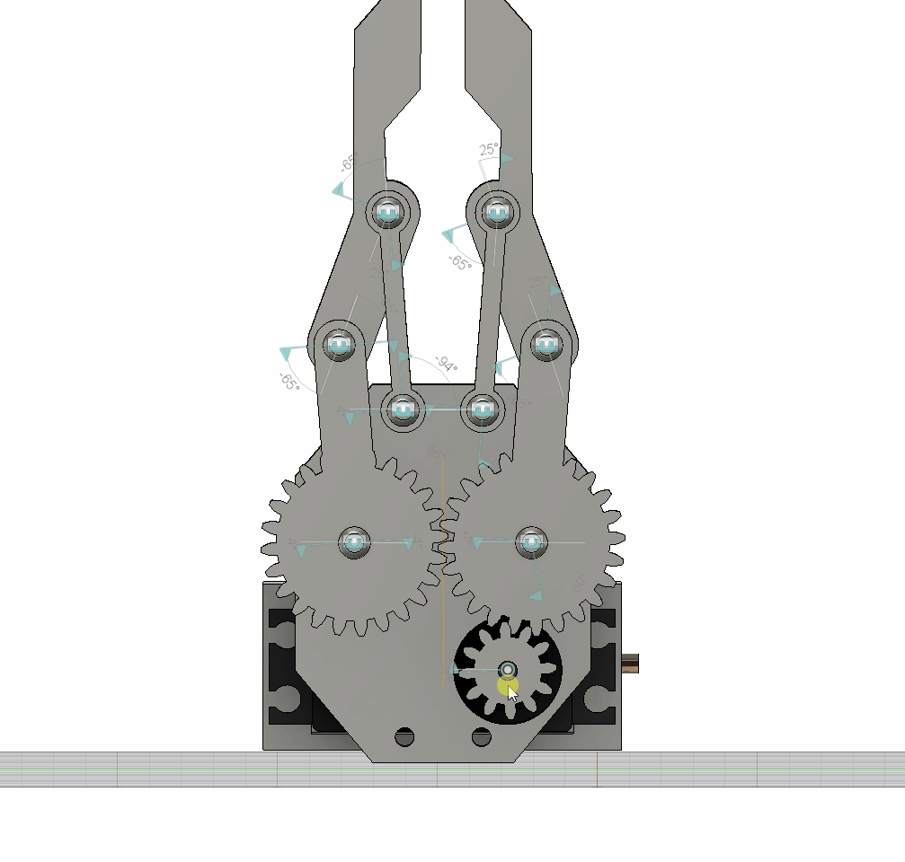
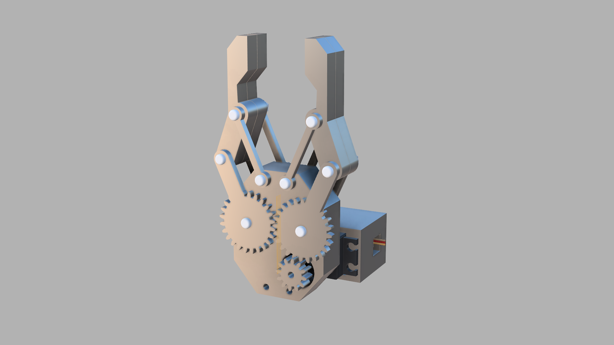

# Захват роборуки

## Концепция

Основная задача захвата — универсальность: устройство должно
работать как с хрупкими, так и с твёрдыми предметами без
предварительной настройки под каждый объект.

### Выбор привода

В качестве привода выбран сервопривод **MG996R**. В отличие от
обычного коллекторного двигателя, сервопривод позволяет задавать
точный угол поворота, что даёт прямой контроль над степенью
смыкания пальцев. Это ключевое требование для адаптивного захвата.

### Выбор механизма

Пальцы захвата приводятся через **шестерёнчатую передачу**.
Это обеспечивает синхронное симметричное сведение обоих пальцев
от одного мотора — объект при захвате не смещается в сторону.
Передаточное число шестерён также позволяет усилить крутящий момент
привода. По сравнению с рычажным механизмом, шестерёнчатая передача
проще в изготовлении методом FDM-печати и даёт более равномерное
усилие по всей траектории движения.

### Обратная связь по силе

Для адаптации усилия зажима используется датчик давления **FSR402**.
Захват не останавливается по фиксированному углу, а реагирует на
фактическое давление на объект — это позволяет удерживать предметы
с разной жёсткостью без риска повреждения.

## О проекте
Проект находится на стадии разработки. В рамках учебной деятельности на **кафедре 307**, Институт №3, **МАИ**.

Захват является **универсальным**: благодаря датчику силы FSR402 и обратной связи в реальном времени, устройство адаптирует усилие зажима — позволяя удерживать как хрупкие объекты, так и твёрдые предметы.

---






## Компоненты

| Компонент | Назначение |
|---|---|
| **MG996R** | Сервопривод — основной актуатор захвата |
| **FSR402** | Датчик силы — обратная связь по давлению |
| **ESP32-C3 Mini** | Микроконтроллер — управление и логика |
| **XL4015 (5A)** | DC-DC buck converter — понижение напряжения |
| **Li-Ion 18650 x2 (7.4V)** | Источник питания |

---

## Принцип работы

```
FSR402 (давление)
       │
       ▼
  ESP32-C3 Mini  ──►  MG996R (сервопривод)
       │
       ▼
  XL4015 + 18650 (питание)
```

1. FSR402 непрерывно считывает силу давления на пальцы захвата
2. ESP32-C3 Mini обрабатывает сигнал и вычисляет необходимое усилие
3. MG996R через шестерёнчатую передачу регулирует степень смыкания пальцев
4. Система останавливает зажим, как только давление достигает заданного порога

### Измерение силы датчиком FSR402

FSR402 — это резистивный датчик: его сопротивление R_FSR падает при увеличении давления. Сила измеряется косвенно — через схему делителя напряжения с опорным резистором R₀:

**Шаг 1.** АЦП ESP32 считывает напряжение на опорном резисторе:

```
V_out = V_cc × R₀ / (R_FSR + R₀)
```

**Шаг 2.** Из напряжения вычисляется сопротивление датчика:

```
R_FSR = R₀ × (V_cc - V_out) / V_out
```

**Шаг 3.** Из сопротивления по характеристике даташита вычисляется сила:

```
F ≈ 1 / (R_FSR × k)
```

где `k` — константа чувствительности датчика (из даташита FSR402), `F` — сила в Ньютонах.

На практике ESP32 считывает напряжение с датчика через встроенный
АЦП (аналого-цифровой преобразователь) и сравнивает полученное
число с пороговым значением, подобранным экспериментально.

---

## Конструкция

Механизм основан на **шестерёнчатой передаче** — пальцы захвата синхронно сводятся и разводятся через зубчатые колёса, что обеспечивает:
- симметричный захват
- плавное регулирование усилия
- компактность конструкции

Все детали изготовлены FDM технологией, материалом PETG и TPU (95A)

### Габариты

| Параметр | Значение |
|---|---|
| Высота | 120.59 мм |
| Ширина | 46.22 мм |
| Глубина | 17 мм |


Суммарная площадь контакта с предметом: X мм²

---

## Структура репозитория

```
├── README.md
├── media/
│   └── gripper_demo.gif      # анимация работы механизма
│   └── Render.png            # рендер
├── CAD/
│   ├── Сборка.f3z            # 3D модель захвата (Fusion 360)
│   ├── Сборка.step           # 3D модель захвата (универсальный формат)
│   └── drawing.cdw           # чертёж сборки (КОМПАС-3D)
└── └── Электронный модуль.step   # электронный модуль питания
```

---

## Инструменты разработки

- **Autodesk Fusion 360** — 3D моделирование
- **КОМПАС-3D** — конструкторская документация (ГОСТ)
- **Bambu Lab P1S** — FDM печать деталей

---

## Автор

**Орос Тимофей Иванович** — М3О-114БВ-25, кафедра 307, Институт №3, МАИ

[](https://github.com/Oros-01)
